<div align="center">

# ✦ EventEase

### Student Event Discovery & Registration Platform

*Your campus. Your opportunities. One place.*


**Customer Experience Design & Programming (CUCS1012)** · Centurion University of Technology and Management

<a href="presentation/EventEase_Ad.mp4">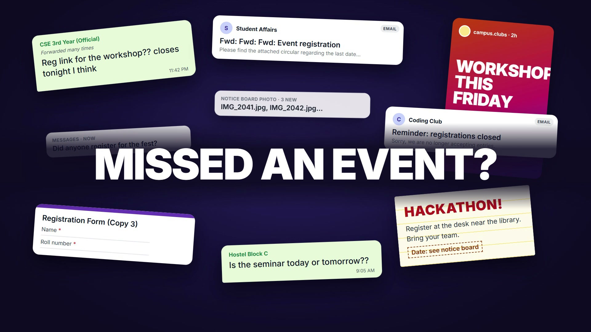</a>

▶️ [Watch the 23-second ad](presentation/EventEase_Ad.mp4) · 📊 [Presentation](presentation/EventEase_CX_Case_Study.pdf) · 🛠️ [Technical guide](docs/TECHNICAL.md)

</div>

---

## 🎯 The problem

Campus event information is scattered across WhatsApp groups, Instagram, posters, friends and the college portal. An exploratory survey of **22 students** (primarily second year) showed what that costs:

<table>
<tr>
<td align="center" width="33%"><h2>63.6%</h2><b>14 / 22</b> students had <b>missed an event</b> because they didn't know about it in time</td>
<td align="center" width="33%"><h2>68.2%</h2><b>15 / 22</b> frequently or sometimes <b>searched WhatsApp</b> or other platforms for event info</td>
<td align="center" width="33%"><h2>45.5%</h2><b>10 / 22</b> picked <b>complete event details</b> as one of the most useful features</td>
</tr>
</table>

> **Design goal:** create a centralized, low-friction experience for discovering, registering for and managing campus events.

---

## 🧭 How it was designed

```
 🔍 Research  →  💡 CX insights  →  👤 Persona  →  🗺️ Journey map  →  ✏️ Design  →  💻 Prototype
```

<table>
<tr>
<td align="center" width="33%"><a href="docs/research/userpersona.png">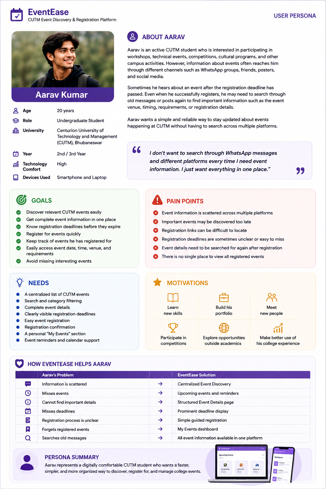</a><br><b>User persona</b></td>
<td align="center" width="33%"><a href="docs/research/journeymap.png">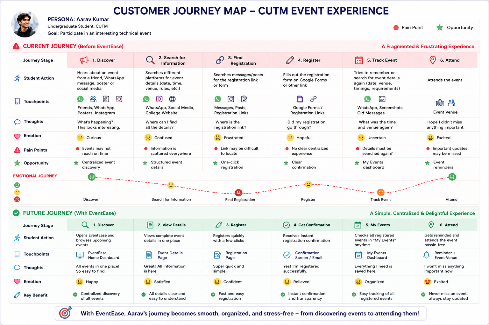</a><br><b>Customer journey map</b></td>
<td align="center" width="33%"><a href="docs/research/userflow.png">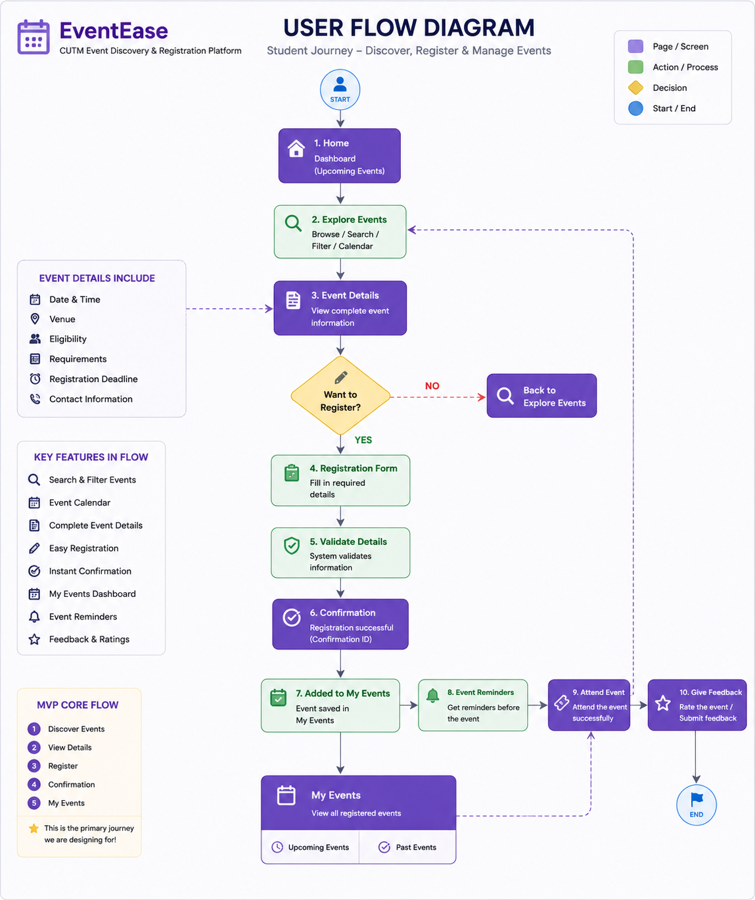</a><br><b>User flow</b></td>
</tr>
</table>

Every feature traces back to a research need:

| 🔎 Students needed… | ✅ EventEase gives them… |
|---|---|
| Complete event details | An **Event Details** page with date, venue, eligibility, fee, seats and deadline |
| An event calendar | A **Calendar** of every campus event |
| Reminders | **Notifications** before events and deadlines |
| One place for their registrations | **My Events**: upcoming, past and saved |
| Proof of registration | A **QR event pass** checked at the door |

---

## 📸 Screenshots

<table>
<tr>
<td width="50%">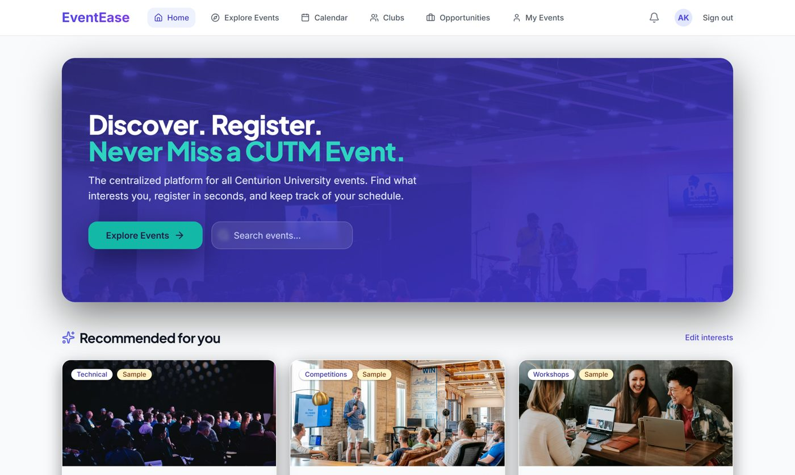<br><b>🏠 Home</b>: recommendations that explain <i>why</i></td>
<td width="50%">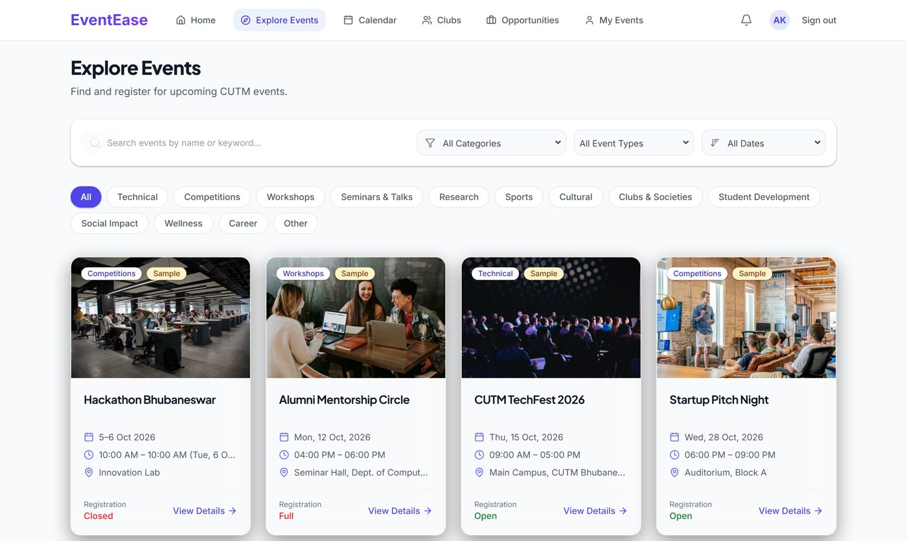<br><b>🧭 Explore</b>: search and category filters</td>
</tr>
<tr>
<td>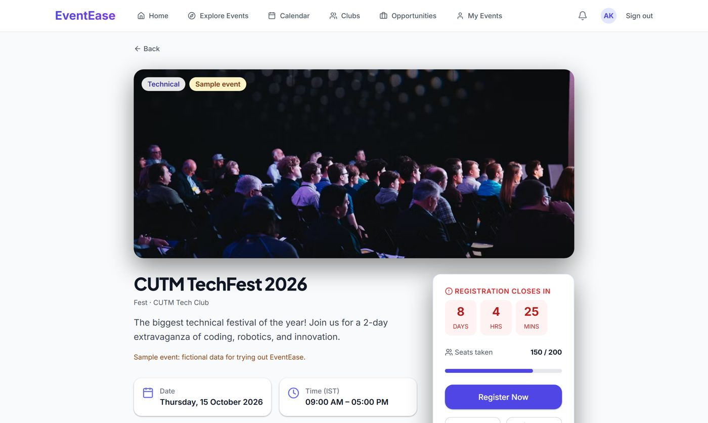<br><b>📄 Event details</b>: everything on one page, with a deadline countdown</td>
<td>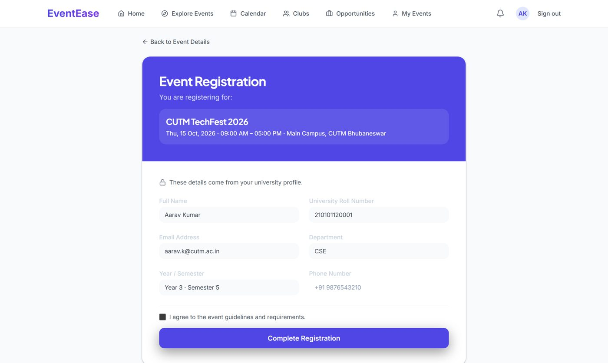<br><b>📝 Register</b>: details pre-filled from the student profile</td>
</tr>
<tr>
<td>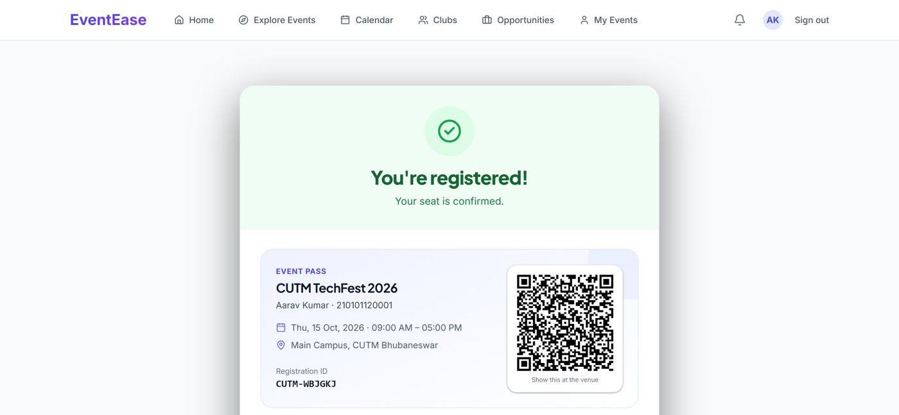<br><b>🎟️ Confirmation</b>: a signed QR event pass</td>
<td>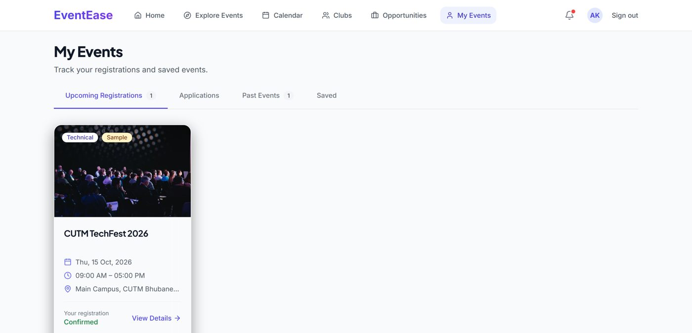<br><b>📋 My Events</b>: all registrations in one place</td>
</tr>
<tr>
<td colspan="2" align="center">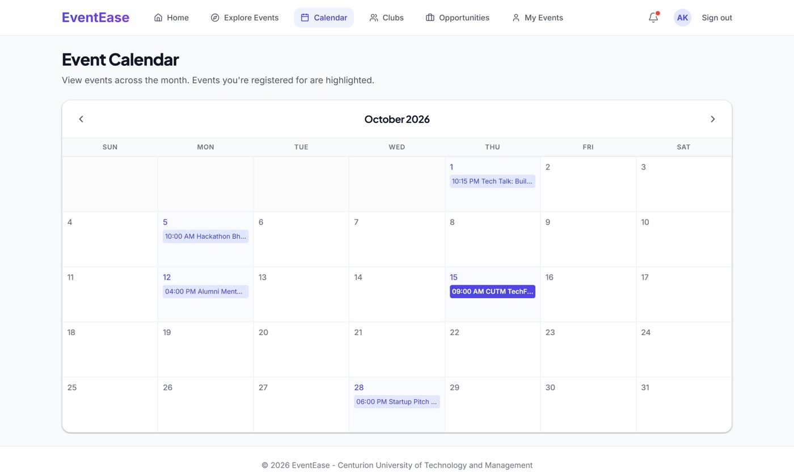<br><b>📅 Calendar</b>: registered events highlighted</td>
</tr>
</table>

---

## ✨ Features

| 🎓 Students | 🧑‍💼 Organizers | 🛡️ Admins |
|---|---|---|
| Discover, search & filter events | Create events & submit for approval | Approve, request changes or reject |
| Register with eligibility & seat checks | Participants list & CSV export | Clubs & organizer roles |
| QR pass (works offline) | QR check-in at the door, even offline | Campus-wide insights & exports |
| Waitlists, teams, paid events | Announcements to registrants | Payments & refunds overview |
| My Events, calendar & reminders | Results & certificates | Message log |
| Feedback & verifiable certificates | Event analytics | |
| Clubs & opportunities | | |

Real CUTM events are shown **only with the details that were officially announced**; anything unknown says "Not specified" instead of being guessed.

---

## 🛠️ Tech stack

| Layer | Technology |
|---|---|
| 🎨 Front end | React 19 · TypeScript · Vite · Tailwind CSS · React Router |
| ⚙️ Back end | Node.js 24 · Hono (REST API) · Zod validation |
| 🗄️ Database | SQLite (better-sqlite3) · Kysely (queries & migrations) |
| 🎟️ QR codes | `qrcode` (passes) · `jsQR` (door scanner) |
| ✅ Quality | 97 automated server tests · oxlint |

---

## 🚀 Run it locally

**You need:** [Node.js 24+](https://nodejs.org). No database server or accounts required.

```bash
npm install
npm run db:reset -w server -- --with-samples   # load the CUTM events + demo data
npm run dev                                     # start the API and the web app
```

Open **http://localhost:5173**, click **Sign in**, and pick a demo account:

| Account | Try this |
|---|---|
| 👩‍🎓 **Aarav Kumar** (student) | Register for *CUTM TechFest 2026*, see the QR pass, rate the AI & ML Workshop |
| 👩‍🎓 **Priya Das** (student) | A paid event with the test payment gateway, and team registration |
| 🧑‍💼 **Rahul Sharma** (club organizer) | Participants, QR check-in, announcements, analytics |
| 🛡️ **Student Affairs Office** (admin) | Approvals, clubs, insights, payments |

> Demo accounts and sample events are fictional. See the [technical guide](docs/TECHNICAL.md) for every script, account and feature.

---

## 📁 Project structure

```
eventease-platform/
├── 🎨 web/            React front end
├── ⚙️ server/         Hono API, SQLite database, tests
├── 📊 presentation/   Deck (PPTX + PDF), speaker script, 23-second ad
└── 📚 docs/           Technical guide, product blueprint, research, screenshots
```

---

## ⚠️ Status

**Functional academic prototype, not deployed at CUTM.** It uses development stand-ins: a demo sign-in instead of university SSO, a test payment gateway, and messages printed to the console instead of real email/SMS. A production version would need university-approved single sign-on, infrastructure and institutional integration.

---

<div align="center">

**Payal Priyadarshini Jena** · B.Tech Computer Science & Engineering
Guided by **Perween Rumana** · Semester V, 2026–27

*EventEase turns "Where did I find that event?" into "Everything I need is here."*

</div>
